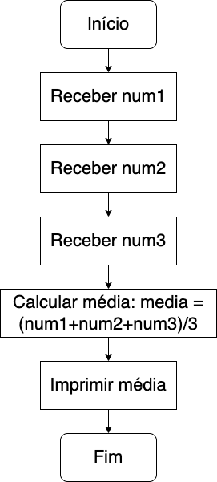

# Algoritmos na programação

## Introdução

Quando falamos de programas de computador, você deve imaginar que as instruções tem outras finalidades além de trocar uma lâmpada ou o pneu de um carro.

Na verdade, quando pensamos em algoritmos em programas, provavelmente estamos falando de **manipulação de dados**.

## Etapas de um algoritmo

Pra isso, é importante dividir o algoritmo em três fases fundamentais: entrada de dados, processamento e saída de dados.

Pra entender melhor esse conceito, imagine o seguinte problema:

`Construa um algoritmo para calcular a soma de dois números`

Vamos considerar a divisão em 3 etapas:

a. Entrada de dados:

- O primeiro número e o segundo número

b. Processamento:

- Somar o primeiro número ao segundo número

c. Saída de dados:

- A soma dos dois números

Portanto o algoritmo pode ser escrito como:

- Passo 1: Receba o primeiro número
- Passo 2: Receba o segundo número
- Passo 3: Some os dois número
- Passo 4: Exiba o resultado da soma

## Representação de algoritmos

Na programação, algoritmos são representados de duas maneiras. A primeira delas é o **pseudocódigo** e a segunda o **diagrama de blocos**.

### Pseudocódigo

O pseudocódigo é uma mistura de palavras-chave de diversas linguagens de programação e um estilo de escrita similar ao português. Ele é bem semelhante aos algoritmos vistos anteriormente, mas incorpora também as palavras-chave.

Veja esse exemplo simples de pseudocódigo que mostra como calcular o valor médio de três números:

```
definir num1, num2, num3 como inteiros
definir media como um real

atribuir num1 o valor 10
atribuir num2 o valor 20
atribuir num3 o valor 30

atribuir media o valor de (num1 + num2 + num3) dividido por 3
imprimir media
```

Não se preocupe muito com as palavras-chave por agora, o importante é entender as operações que estão sendo realizadas

Veja que o pseudocódigo não é uma linguagem de programação real e não pode ser executado diretamente por um computador. Em vez disso, ele é usado como um guia para ajudar a escrever um programa em uma linguagem de programação específica.

### Diagrama de blocos

Já o diagrama de blocos é uma ferramenta visual que pode ser usada para representar a lógica de um algoritmo ou processo. Ele consiste em uma série de blocos interconectados que representam as etapas do algoritmo e as decisões que precisam ser tomadas.

Cada bloco no diagrama de blocos representa uma etapa do algoritmo e pode conter instruções detalhadas sobre o que deve ser feito naquele ponto. Alguns blocos também podem conter perguntas ou condições que determinam o que acontece a seguir no algoritmo. Os diagramas de blocos são úteis porque permitem que você visualize o fluxo de um algoritmo de uma maneira fácil de entender.

Dá uma olhada no mesmo exemplo de um diagrama de blocos que mostra como calcular o valor médio de três números:



Não só no processo de aprendizado, mas em qualquer projeto de algoritmo, é interessante usar uma ou até mesmo ambas representações, tanto diagrama quanto pseudocódigo
